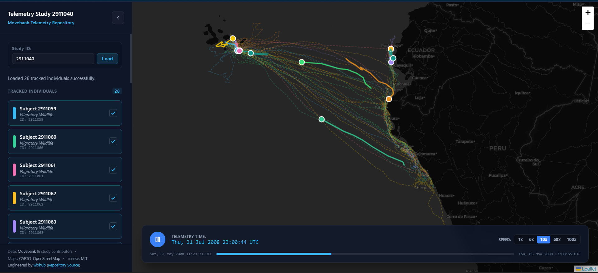

# Spatial-Temporal Migration Playback



## Movebank Data Repository & Animal Tracking

A high-performance scientific web application built with Angular 22 (with Signals), TypeScript, Leaflet.js and SCSS for interactive playback and visualization of animal migration telemetry over geographical map layers.

## 🚀 Live Demo

🔗 **[View Live Application on Cloudflare Pages](https://spatial-temporal.pages.dev)**

## 🚀 Key Features

- Interactive Map Integration (Leaflet.js): Responsive map viewport rendering historical migration paths (polylines) and real-time interpolated animal position markers based on geographic coordinates (latitude, longitude, timestamp).

- Timeline Playboard & Controls: Custom timeline controller featuring Play, Pause, Scrubbing (seek bar) and Speed Scaling ($1\times, 5\times, 10\times, 50\times$) to animate telemetry playback smoothly across temporal horizons.

- Angular Signals State Management: Reactive state handling powered by Angular Signals for tracking current playback time, active datasets, selected animal individuals and speed scaling.

- Movebank Data Service & Mock Mode: Robust data layer supporting Movebank CSV/JSON payload formats with a built-in mock dataset mode for offline development and testing.

- Scientific Dashboard Layout: Sleek collapsible sidebar for filtering individuals/species, telemetry metadata inspection and a full-viewport map container.

## 📁 Project Architecture

```text
src/
├── app/
│   ├── core/
│   │   ├── layout/
│   │   │   ├── shell/                # Main application shell layout
│   │   │   └── sidebar/              # Collapsible sidebar for filtering & metadata
│   │   ├── models/
│   │   │   └── telemetry.model.ts    # Interfaces for telemetry, tracks and individuals
│   │   └── services/
│   │       └── migration.service.ts  # Data parsing, Movebank integration and signal state
│   ├── features/
│   │   ├── map-view/                 # Leaflet.js map component & marker management
│   │   ├── timeline/                 # Play/pause, scrubbing and speed scaling controls
│   │   └── powered/                  # Metadata & status indicators
│   ├── app.component.ts              # Main layout coordinator
│   ├── app.component.html
│   ├── app.component.scss
│   └── app.config.ts                 # Application configuration (zoneless/providers)
├── styles.scss                       # Global design system & Leaflet CSS imports
└── index.html
```

## Data Source & Backend Proxy

- **Cloudflare Worker Integration**: The application utilizes a dedicated serverless worker as an online data source and API proxy. It securely fetches live telemetry streams from the Movebank API, handles CORS limitations and parses raw CSV responses into strongly-typed data models.

- **Backend Endpoint**: 🔗 **[View Worker on Cloudflare Workers](https://wispy-surf-c9db.rublin.workers.dev/)**

- **Data Attribution**: Telemetry data is accessed via the **[Movebank API](www.movebank.org)** and provided by individual study contributors. Map tiles are powered by **CARTO** under CC BY 3.0, utilizing data from **OpenStreetMap** contributors.

## 🛠️ Tech Stack

- Framework: This project was generated using [Angular CLI](https://github.com/angular/angular-cli) version 22.1.3.

- Language: TypeScript

- Mapping Library: Leaflet.js & @types/leaflet

- Styling: SCSS with modern CSS Grid/Flexbox layouts

- Build Tool: Angular CLI

## ⚙️ Getting Started

Prerequisites:

- Node.js (v24.15.0 recommended)
- npm or yarn

## Installation

Clone the repository:

```bash
git clone https://github.com/wixhub/spatial-temporal.git
cd spatial-temporal
```

Install dependencies:

```bash
npm install
```

## Development server

To start a local development server, run:

```bash
ng serve
```

Once the server is running, open your browser and navigate to `http://localhost:4200/`. The application will automatically reload whenever you modify any of the source files.

## Code scaffolding

Angular CLI includes powerful code scaffolding tools. To generate a new component, run:

```bash
ng generate component component-name
```

For a complete list of available schematics (such as `components`, `directives`, or `pipes`), run:

```bash
ng generate --help
```

## Building

To build the project run:

```bash
ng build
```

This will compile your project and store the build artifacts in the `dist/` directory. By default, the production build optimizes your application for performance and speed.

## Running unit tests

To execute unit tests with the [Vitest](https://vitest.dev/) test runner, use the following command:

```bash
ng test
```

## Running end-to-end tests

For end-to-end (e2e) testing, run:

```bash
ng e2e
```

Angular CLI does not come with an end-to-end testing framework by default. You can choose one that suits your needs.

## Additional Resources

For more information on using the Angular CLI, including detailed command references, visit the [Angular CLI Overview and Command Reference](https://angular.dev/tools/cli) page.

## 📜 License

- **Software License**: This project is open-source software licensed under the **[MIT License](./LICENSE)**.

- **Data & Map Attribution**:
  - Animal tracking data provided by **[Movebank](www.movebank.org)** and individual researchers.

  - Map tiles by **CARTO**, under CC BY 3.0. Data by **OpenStreetMap** contributors.
